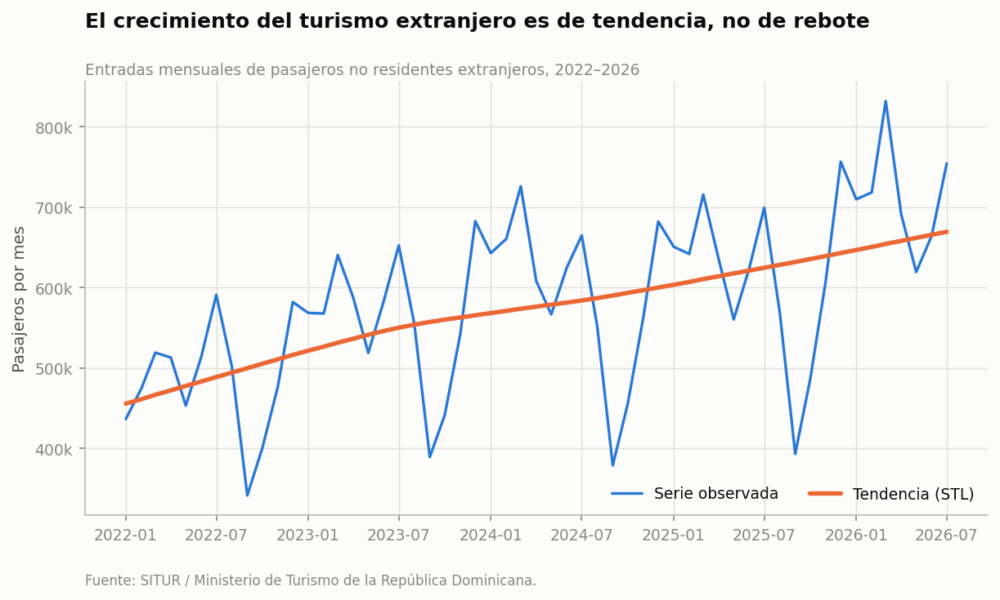

# Turismo en República Dominicana: estacionalidad, mercados y predicción

Análisis de datos abiertos oficiales sobre el sector turístico dominicano,
enero 2022 – julio 2026 (55 meses).

**Pregunta:** el turismo dominicano creció fuerte después de la pandemia.
¿Ese crecimiento cambió la *estructura* del sector — cuándo llega la gente,
de dónde viene y a qué polo turístico va — o simplemente hay más de lo mismo?



## Hallazgos y qué hacer con ellos

| Hallazgo | Qué implica decidir |
|---|---|
| **Tendencia.** +46.9% en la tendencia STL en 4.5 años, sin señales de saturación. | El crecimiento es estructural, no rebote. La restricción a vigilar es de capacidad —habitaciones y asientos—, no de demanda. |
| **Estacionalidad.** No se aplanó: la amplitud del factor estacional sigue en ~0.5–0.6 todos los años y septiembre está ~35% por debajo de la tendencia. | Lo que se esté haciendo para llenar la temporada baja no está moviendo la aguja. Antes de gastar más en lo mismo, conviene medirlo: la amplitud estacional anual es el indicador, y necesita bajar de forma sostenida, no un mes bueno suelto. |
| **Mercados.** EE.UU. cae de 59% a 54% de cuota; Argentina pasa de 5.6% a 9.5%. Europa pierde peso. | La diversificación ya está ocurriendo sola y es sudamericana. El margen barato está en acompañar esa corriente —conectividad y promoción hacia el Cono Sur— en vez de intentar recuperar Europa, que va en contra. Y Argentina llega en temporada baja del norte: es el mismo problema del punto anterior, resuelto por otra vía. |
| **Predicción.** SARIMAX a 1 mes: **MAPE 3.9%** vs 5.7% de la referencia ingenua `y(t−12)`. Agregar vuelos regulares como exógeno **empeora** el modelo. | 3.9% de error a un mes es suficiente para planificar personal y compras hoteleras. El modelo simple gana: no hace falta más complejidad, hace falta más historia. |

Un quinto resultado —la elasticidad entre llegadas por aeropuerto y ocupación de
su zona— quedó en el notebook y **no en esta tabla a propósito**: es positivo
(+0.76 pp por cada +10% de llegadas) pero se apoya en solo seis clusters y en un
mapeo aeropuerto→zona que armé yo. Da para una hipótesis, no para una conclusión.

Todas las figuras están en [`reports/figures/`](reports/figures) y el análisis
completo, con el razonamiento y los límites de cada resultado, en
[`notebooks/analisis.ipynb`](notebooks/analisis.ipynb).

## Datos

Todo viene de fuentes oficiales dominicanas de acceso abierto:

| Fuente | Qué aporta | Cobertura |
|---|---|---|
| [SITUR / MITUR](https://situr.mitur.gob.do/estadisticas/descargas/) | Flujo migratorio, entradas por aeropuerto, país de nacionalidad y residencia, ciudad de salida, ocupación hotelera por zona, vuelos | Mensual, 2022–presente |
| [Banco Central, sector turismo](https://www.bancentral.gov.do/a/d/2537-sector-turismo) | Llegadas totales, gasto turístico, estadía promedio, valor agregado del sector | Anual/mensual, desde 1978 |
| [ONE — Datos y estadísticas](https://www.one.gob.do/datos-y-estadisticas/) | Contexto demográfico y económico, ENHOGAR, censo | Varía |

Las URLs exactas de cada archivo están en `src/config.py`.

### Por qué los Excel oficiales necesitan un parser

Los archivos de SITUR no son tablas limpias: traen el logo institucional, títulos
en las primeras filas, **encabezados en dos niveles con celdas combinadas**, el año
escrito una sola vez por bloque de 12 meses, meses en español y notas al pie.
`pd.read_excel()` directo devuelve basura. `src/tidy.py` resuelve eso de forma
genérica: localiza la fila `Año | Mes`, reconstruye los nombres combinando los
niveles superiores, arrastra el año hacia abajo y descarta las notas.

## Cómo correrlo

```bash
pip install -r requirements.txt

python -m src.download    # baja los Excel oficiales a data/raw/
python -m src.build       # los limpia a data/processed/*.csv
python -m src.figuras     # genera reports/figures/*.png
jupyter lab notebooks/analisis.ipynb
```

El repo incluye una **instantánea** de `data/processed/` (datos al 5 de agosto de
2026) para que el notebook corra sin depender de que los servidores estén arriba.
Una diferencia: la instantánea de `nacionalidad_wide.csv` trae los **20 mercados
principales**; al correr `src.build` se obtienen los 135 países completos, y el HHI
baja un poco en consecuencia. Las conclusiones no cambian, los decimales sí.

## Estructura

```
src/config.py     URLs de todas las fuentes + mapeo aeropuerto→zona
src/download.py   descarga los Excel crudos
src/tidy.py       parsers de los Excel de SITUR (encabezados de dos niveles)
src/build.py      raw → processed, el contrato con los notebooks
src/analisis.py   STL, HHI, panel con efectos fijos, backtest SARIMAX
src/viz.py        tema de gráficos (paleta validada para daltonismo)
src/figuras.py    genera todas las figuras
notebooks/        el análisis narrado
```

## Decisiones metodológicas

- **"Turista" = no residente extranjero.** El dato oficial separa residencia
  (residente / no residente) de nacionalidad (dominicano / extranjero). Un
  dominicano de la diáspora que viene de visita es *no residente dominicano*:
  entra en las llegadas pero tiene otro calendario (pico en diciembre, no en
  marzo) y otro patrón de gasto. Se analiza aparte.
- **STL robusto en vez de descomposición clásica.** Con `robust=True` los meses
  atípicos no arrastran el componente estacional.
- **Validación con ventana expansiva, no `train_test_split`.** En series de tiempo
  una partición aleatoria filtra el futuro dentro del entrenamiento y produce un
  error falsamente bajo. Acá el modelo se reajusta en cada mes con solo el pasado.
- **Toda predicción compite contra `y(t−12)`.** Un modelo que no le gana al mismo
  mes del año anterior no aporta nada.

## Límites conocidos

- Solo 55 meses. Alcanza para estacionalidad y pronóstico a un mes; no para
  afirmaciones de ciclo largo. Para eso hay que enganchar las series del Banco
  Central (llegadas desde 1978).
- El panel aeropuerto→zona tiene **seis clusters**: los errores estándar agrupados
  son frágiles con tan pocos grupos, y el p-valor de 0.047 no es una frontera dura.
- Ese mismo mapeo aeropuerto→zona es una **hipótesis de trabajo**, no un dato
  oficial. Está declarado en `src/config.py` justamente para poder cambiarlo.
- La relación vuelos↔ocupación es **endógena**: las aerolíneas ponen capacidad
  donde hay demanda. Los resultados son asociaciones condicionales, no efectos
  causales.

## Licencia

Código bajo MIT. Los datos son de MITUR, el Banco Central y la ONE; se rigen por
los términos de cada institución.
